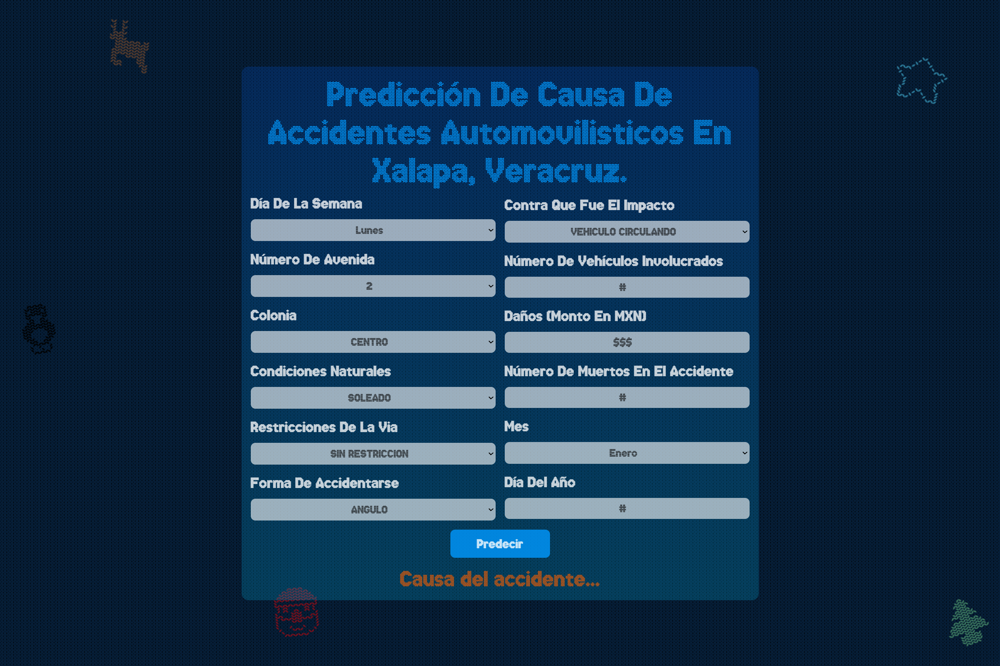

# Evidencia de despliegue
A continuacion se muestra la evidencia del despliegue de la aplicación web

# Evidencias de funcionamiento
A continuación se muestra el funcionamiento usando un kubernete de google cloud.

Corriendo el kubernete en cloud

Primera vista del formulario

Resultado, donde se muestra la prediccion obtenida del modelo
